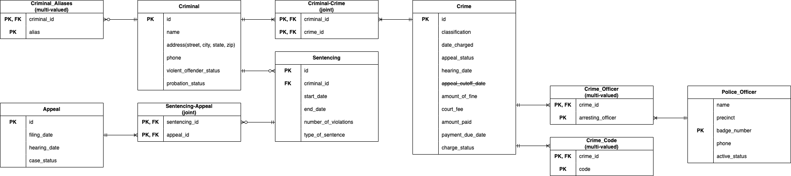

#### ER Diagram

---

#### Schema Statement

criminal(<u>id</u>, name, address, phone, violent_offender_status, probation_status)
sentencing(<u>id</u>, @criminal_id, start_date, end_date, number_of_violations, type_of_sentence)
crime(<u>id</u>, classification, date_charged, appeal_status, hearing_date, amount_of_fine,
		court_fee, amount_paid, payment_due_date, charge_status)
police_officer(name, precinct, <u>badge_number</u>, phone, active_status)
appeal(<u>id</u>, filling_date, hearing_date, case_status)
criminal_aliases(@<u>criminal_id</u>, <u>alias</u>)
sentencing_appeal(@<u>sentencing_id</u>, @<u>appeal_id</u>)
criminal_crime(@<u>criminal_id</u>, @<u>crime_id</u>)
crime_officer(@<u>crime_id</u>, @<u>arresting_officer</u>)
crime_code(@<u>crime_id</u>, <u>code</u>)

---

#### Assumption

> A crminal can commit multiple crimes.

> An `Appeal` is attached to a `Sentence` as reflective of the justice system in real life.