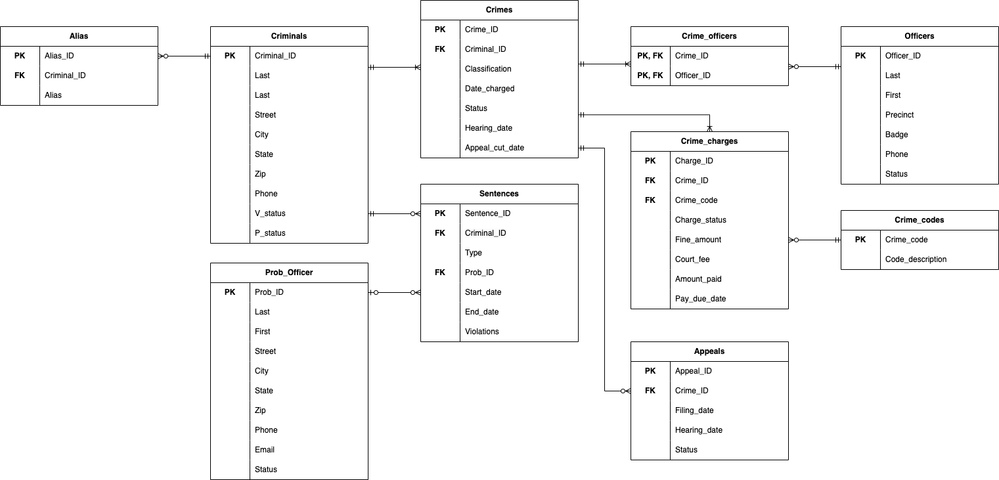
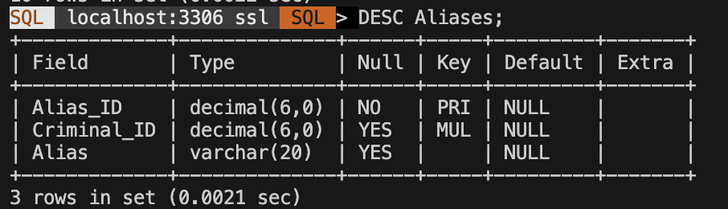
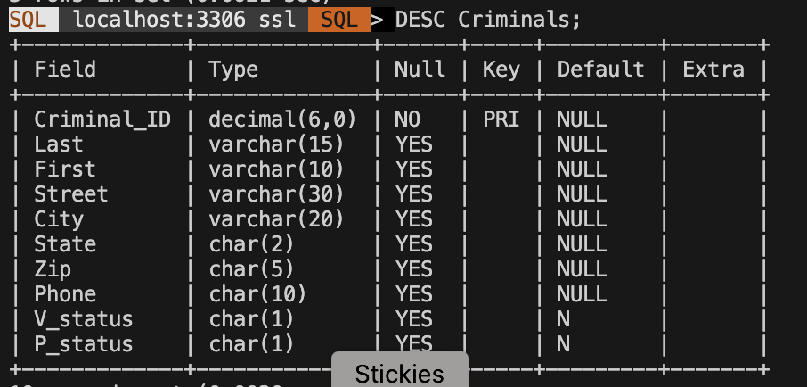
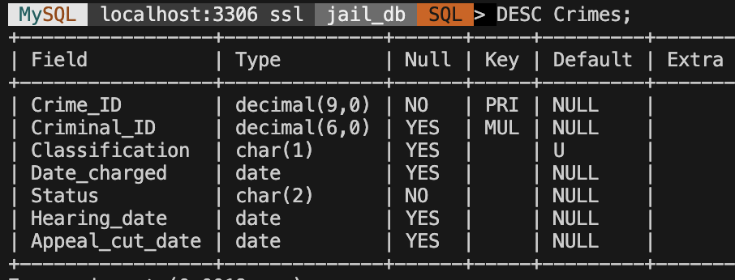
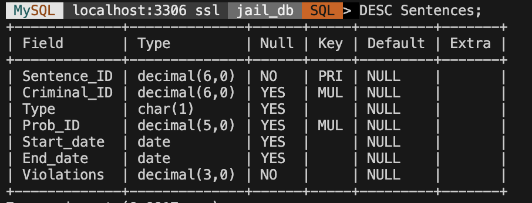
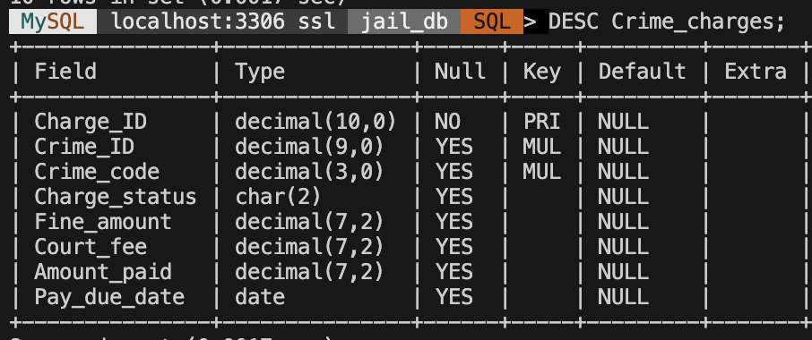
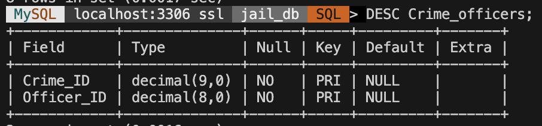
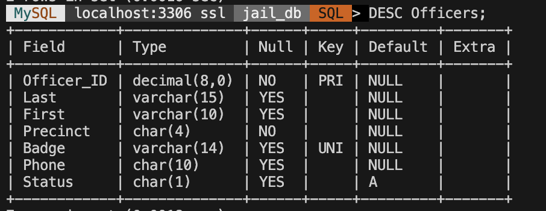
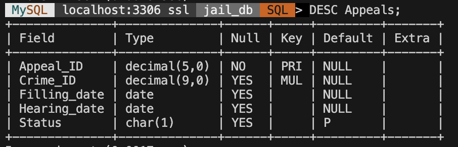
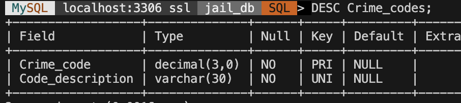

#### Updated E-R Diagram

---

#### Database Server

We plan to host a MySQL database on DigitalOcean.

---

#### Table Schemas (a)
Table aliases

Table appeals

Table crimes

Table crime_charges

Table crime_codes

Table crime_officers

Table criminals

Table officers

Table prob_officers

Table Sentences 

---

#### Table Schemas (b)
Table aliases

#### Data Sample
Table aliases

#### Basic SQL Commands
CREATE PROCEDURE insert_criminal(
    IN p_Criminal_ID DECIMAL(6),
    IN p_Last VARCHAR(15),
    IN p_First VARCHAR(10),
    IN p_Street VARCHAR(30),
    IN p_City VARCHAR(20),
    IN p_State CHAR(2),
    IN p_Zip CHAR(5),
    IN p_Phone CHAR(10),
    IN p_V_status CHAR(1),
    IN p_P_status CHAR(1)
)

